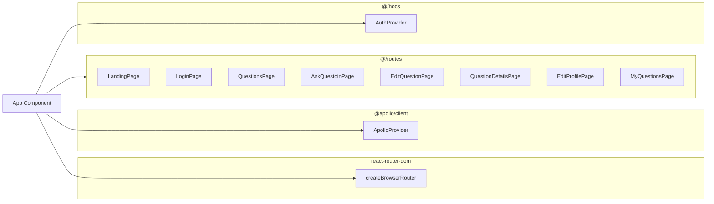

Routing config is placed inside the `App` component
## `App` Component

source: `@/App.tsx`

This component loads all the page components from `@/routes` into routing configuration that is then passed to `createBrowserRouter` function. It also provides all the necessary context variables for app to function correctly.

**Provided contexts**:

- Auth context
- Apollo client context
- Mui theme and cache

Note that the details of  MUI theme dataflow is not mentioned in the document

