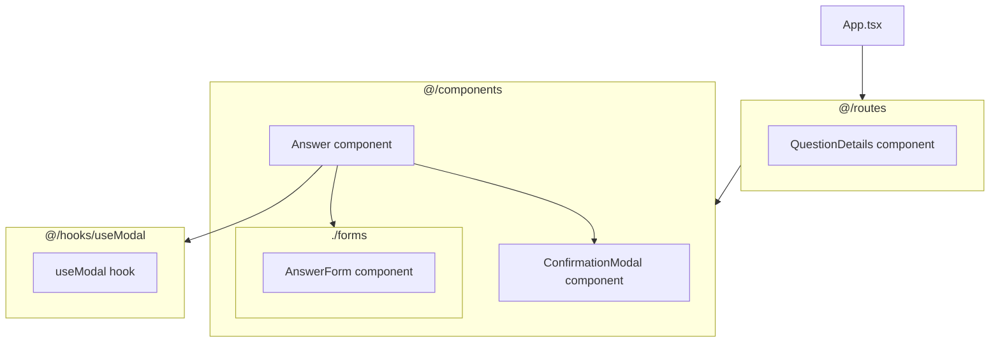

## `Answer` component

the answer component is responsible for displaying the answer data to the user and manage operations within the scope of one singular answer entity.

### Accept & Delete Operations

it has two buttons for deleting and accepting operations it achieves these functionalities by the callback functions that have been passed down as props from the parent component question details.

### Editing Form

And for the purpose of editing it just renders an `AnswerForm` giving it the question ID and the currently displayed answer ID making the component to decide to initiate an update when the user submits the form.

### Role Based Permission Control

It's also worthy of note that only the author of the answer is capable of editing and deleting the answer and only the person who has asked the respective question has the permission to accept the answers and if the currently logged in user account doesn't satisfy these criterias respective action buttons will disappear from the UI.

## `ConfirmationModal` component

in combination with `useModal` hook this component renders a dialogue prompting the user to accept or decline something. This component has been used mostly in deleting operations across the application.

## `AnswerForm` component

Used for rendering an editing form.

this component has been explained in detail [[Posting A New Answer#`AnswerForm` component|here]]
