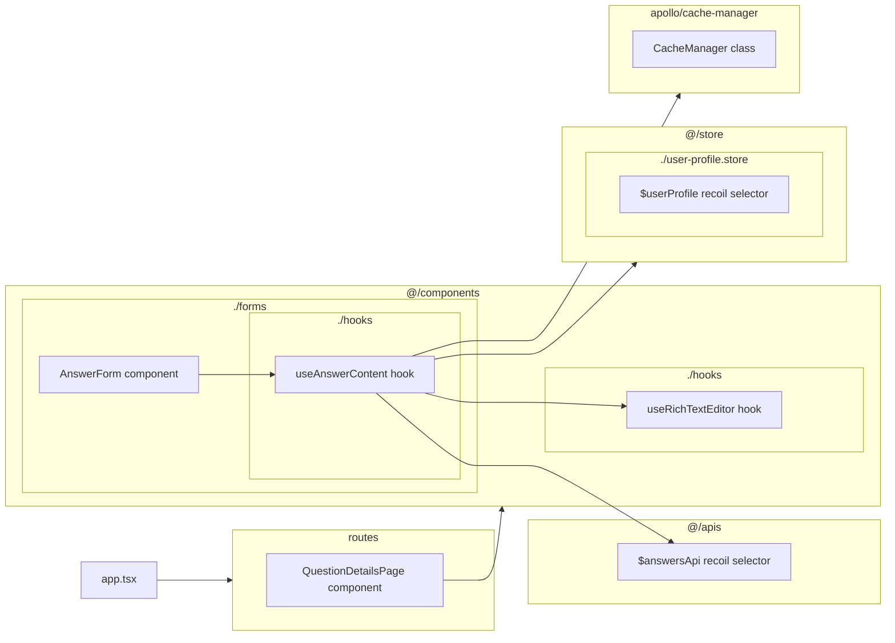
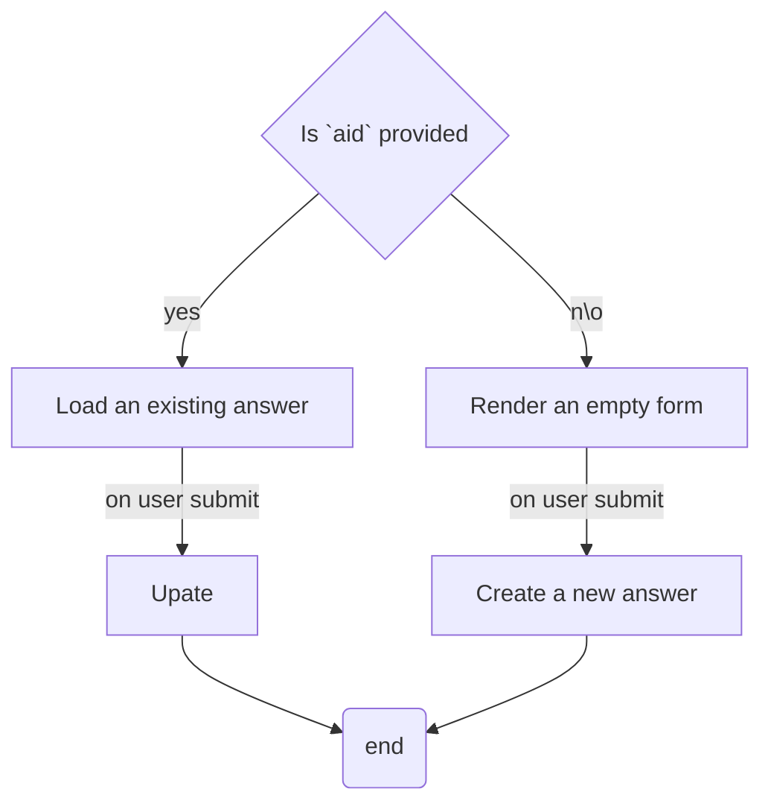

## `AnswerForm` component

This component is capable of posting a new answer or editing an existing one. It has two props: `qid` & `aid` (answer id), the `qid` prop is always required because you can't post an answer without specifying which question is going to receive it. The second prop `aid` is optional. If it set to null, it means to post a new answer but if it is provided, this component will first try to load the content of an existing answer and form submission will cause an update.

empty form:
![[Pasted image 20240823113327.png]]
update form:
![[Pasted image 20240823113358.png]]

### Rich Text Editing

This component allows user to add basic formatting to the text, like: `bold`, `italic` etc... using keyboard symbols like `**content**` for bold. It uses `EditorContent` component of `@tiptap` directly.

> We have plans to replace `EditorContent` with [[Asking A New Question#`TextEditor` component|TextEditor]] component from `@/components/text-editor` which has an API similar to `EditorContent` that makes it a drop-in replacement for `EditorContent`. It also has better text editing features.

### API Logic

In order to isolate some of the complexity, all the form handling and API interaction logic has been offloaded to `useAnswerContent` hook.

## `useAnswerContent` hook

- Exposes `useRichTextEditor` hook
- Exposes functions for form handling and simpler api interaction
- Updates local apollo cache through `CacheManager` class
- Decides between update or create operations

## `CacheManager` class

This class exposes simple static methods to manage apollo cache.

> Some components are still interacting with apollo cache directly and manually. We have plans to extract those parts and add them as methods to this class in the future.

