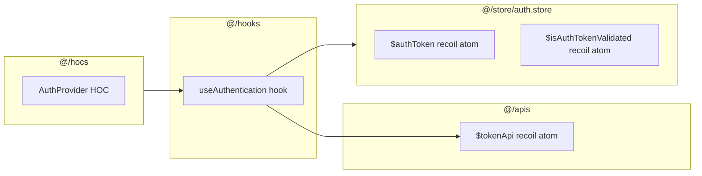
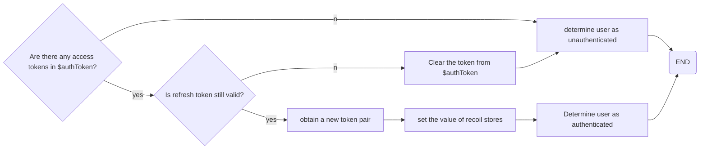

## `AuthProvider` HOC

This high order component is responsible for initiating the `useAuthentication` hook. This component is called inside `App.tsx` when the application loads, this causes this mechanism to happen automatically.

It also blocks the rendering of rest of the components of the application unless the authentication state is determined by `useAuthentication` hook (the `loading` state becomes `false`)

## `useAuthentication` hook

This hook is responsible for determining the state of authentication in application context and keeping the user logged in by obtaining new token pairs every time the application starts

