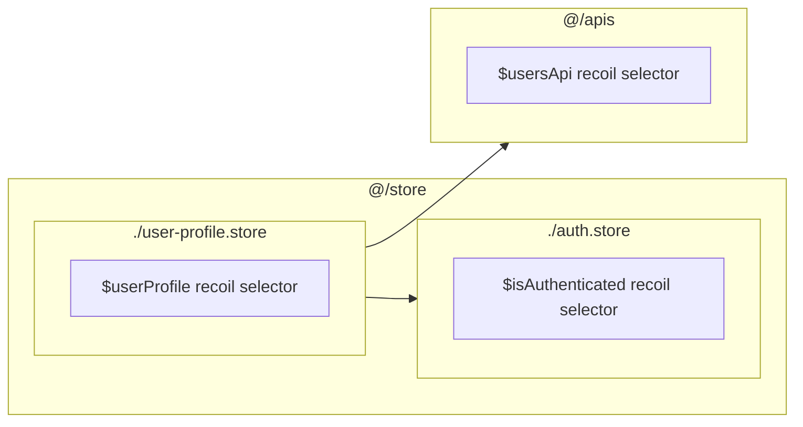

```mermaid
graph LR
	subgraph store["@/store"]
		subgraph user["./user-profile.store"]
			$userProfile["$userProfile recoil selector"]
		end
		subgraph auth["./auth.store"]
			$isAuthenticated["$isAuthenticated recoil selector"]
		end
	end
	subgraph api["@/apis"]
		$usersApi["$usersApi recoil selector"]
	end
	user --> api
	user --> auth
```

## `$userProfile` recoil selector

This selector loads the user profile through `$usersApi` when the context becomes authenticated `$isAuthenticated==true`

