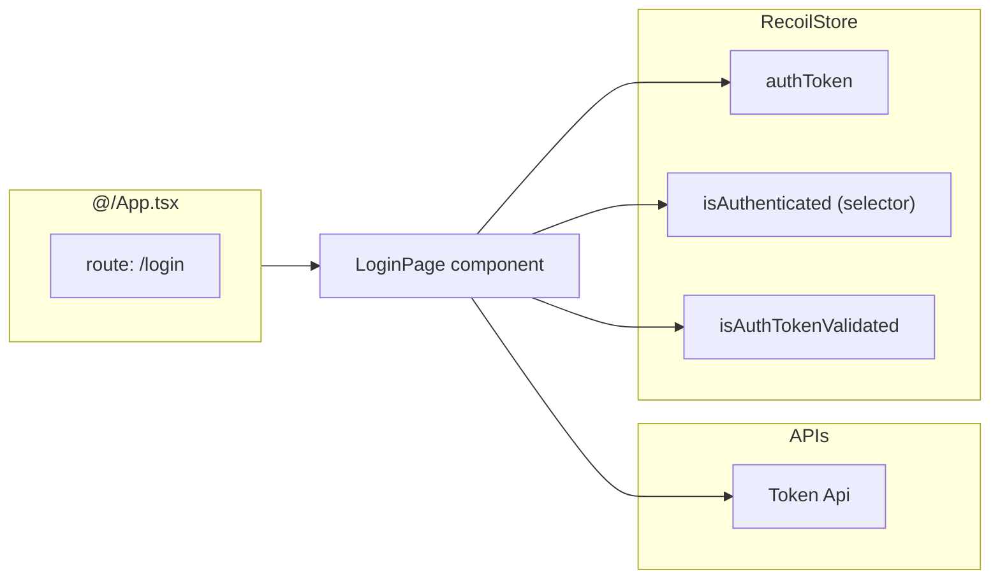

## Login Credentials

Users must provide a correct `username` & `password` to be able to log in

## `LoginPage` Component

source: `routes/LoginPage.tsx`

This component takes care of user login procedure by:
- rendering and controlling the login form
- submiting the form to api using `tokenApi`
- handling returned tokens and saving them to `$authToken` recoil atom

This component is mounted on `/login` path configured in `App.tsx`

![[Pasted image 20240822152255.png]]
## Recoil Store Participants

source: `store/auth.store.ts`
### `$authToken` Recoil Atom

It is responsible for sharing the token information across the app, saving it to `local storage` and loading previously saved tokens when app starts.

### `$isAuthTokenValidated` Recoil Atom

Auth tokens are loaded in two ways:

1. User logs in and token is returned directly as a response from server
2. User starts the app and the previously saved token is loaded

In the second scenario, the loaded token might have been expired, so there should be a state which indicates if the token has been validated or not. Any part of the code that tempers with the value of `$authToken` is also responsible for specifying the value of this state.

### `$isAuthenticated` Recoil Selector

a logical selector which returns a boolean indicating weather the app context is authenticated or not. This boolean value is determined based on the values of `$isAuthTokenValidated` &  `$authToken`

