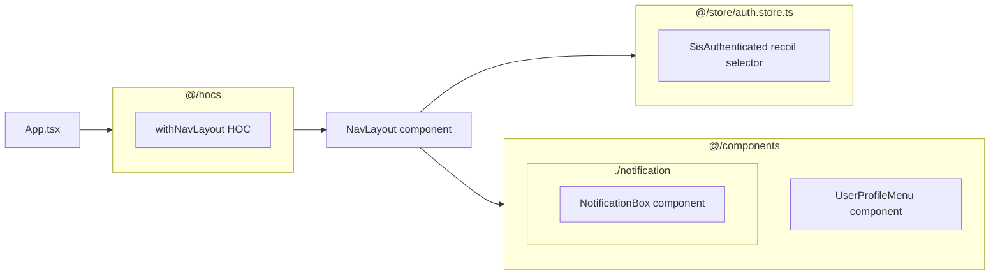

## `withNavLayout` HOC

just a wrapper that takes a component and renders it along `NavLayout`. It is used in routing configuration to keep a consistent layout across application pages

## `NavLayout` component

Renders the top navbar and its contents. It contains the `UserProfileMenu` & `NotificationBox` components as well, therefore these components are rendered on all pages.