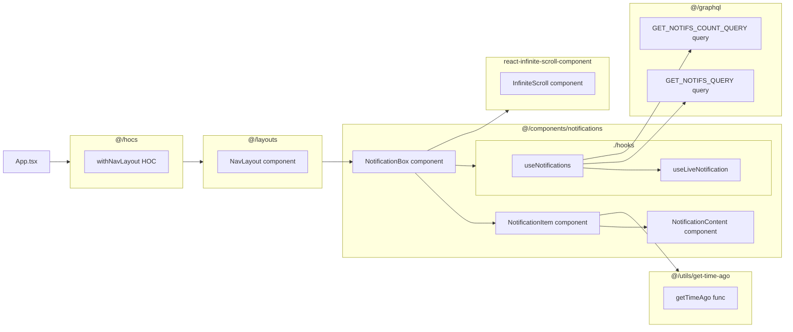

## `NotificationBox` component

![[Pasted image 20240824091623.png]]

this component is responsible for displaying a notification bell in the navigation bar which opens up a notification box when a user clicks on it.

### Loading Notifs

It uses`useNotification` hook in order to load the list of notifications. Then it maps the list data to `NotificationItem` components. The list also includes an infinite scroll functionality which is achieved by react `InfiniteScroll` component.

### Unseen Notifs

The number of unseen notifications is shown as a badge on top the notification bell. There's a `mark as read` button allowing the user to mark the notifications as seen, causing the badge to go away.

> It's also worthy of note that when the user is unauthenticated, `$userProfile` recoil selector will be null, causing the component to render `null`.

## `NotificationItem` component

This component is responsible for displaying one singular notification message. It receives everything it needs about the notification from the parent component, `NotificationBox` and it uses the `getTimeAgo` function in order to show the difference of time in a user friendly manner.

## `NotificationContent` component

this component gets the notification `type`, notification `message`, and the `metadata` from its parent components and turns it into actionable links.

![[Pasted image 20240824092632.png]]

## `useNotifications` Hook

This hook provides an all in one interface for managing notifications by isolating all the REST, GraphQL and cache interactions. It provides the following functionality:

- List of notifications
- Unseen notif count
- Weather we have more notifs in the db or not
- A `fetchMore` function to load more notifications as user scrolls
- live notifs through:  `useLiveNotification` Hook

## `useLiveNotification` Hook

while `useNotifications` Hook loads the initial list of notifications, This hook provides instant notification delivery feature.

### Receiving Instant Noitfs

Notifications are received through a websocket connection to the backend server. This hook hides the details of connection and authentication over websocket protocol.

### Updating The Notification List On UI

When a websocket message is received, this component adds it to the Apollo client cache. Doing so will broadcast updates to `GET_NOTIFS_QUERY` & `GET_NOTIFS_COUNT_QUERY` queries. Since the `NotificationBox` component is watching both of the queries, it will receive the newly delivered notifications.

So here, the Apollo cache is rather acting as a message transport layer.

