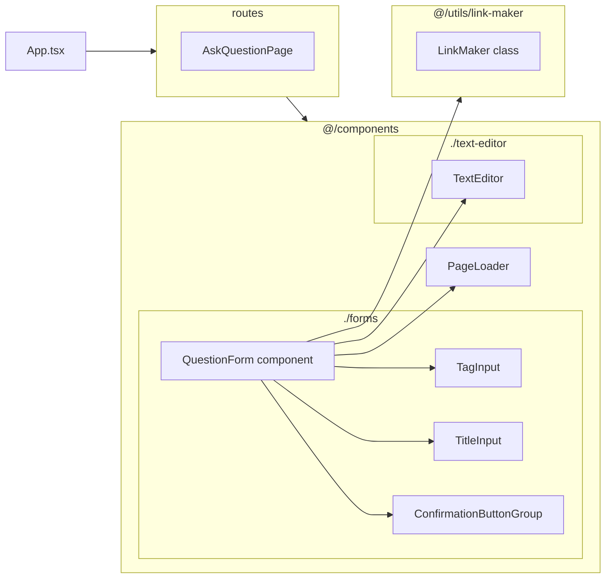

## `AskQuestionPage` component

This component is just used for routing and the only thing it does is to render `QuestionForm` ![[Pasted image 20240822202831.png]]
## `QuestionForm` component

This component is responsible for submitting a form that contains question information. It gets a `qid` (question id) parameter, if it is null, submission will lead to creation of a new question otherwise, the contents of the question with id=`qid` is first loaded into the editor and submission will lead to editing the already existing question contents.

## `LinkMaker` class

This class contains static methods to generate urls to different parts of the app. It is for the purpose of integration and making sure we can easily change routing config in the future.

## `TextEditor` component

This component is responsible for providing a rich text editor with a toolbar and image upload support. It uses `Tiptap` under the hood.

## `ConfirmationButtonGroup` component

It renders two buttons, "accept" or "cancel", binding handlers for each case. It's usually used in forms & dialogs.

## `PageLoader` component

renders a loader UI till the content becomes available.

## `TitleInput` component

self explanatory

## `TagInput` component

Manages a list of tags, used for asking the user to enter some tags.
