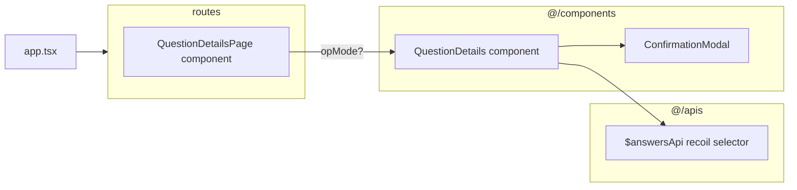

## `QuestionDetails` component

This component displays the details of a question, including author, content,  publish date, etc... and also provides ui elements for editing and deleting purposes.

![[Pasted image 20240824074010.png]]
### Delete Dialog

When the user clicks on the trash can, this component will render a mui dialog component warning the user about the consequences of the operation and asking user permission to continue.

![[Pasted image 20240824074200.png]]

### Permission control

Only an administrator or the original author can delete a question, if the currently authenticated user doesn't pass these criterias, the delete button will disappear.

## `ConfirmationModal` component

read the docs [[Editing, Deleting & Accepting An Answer#`ConfirmationModal` component|here]]

