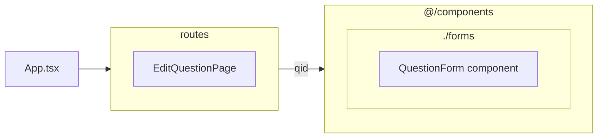

## `EditQuestionPage` component

 ![[Pasted image 20240822202745.png]]

It gets a `qid` parameter from the route params and passes it to `QuestionForm` component

## `QuestionForm` component

explained  [[Asking A New Question#`QuestionForm` component|here]]

