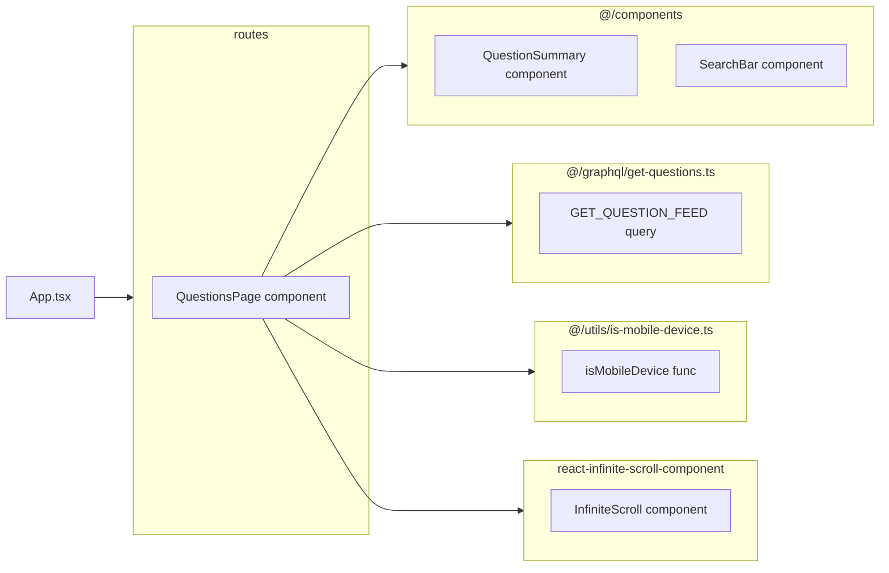

## `QuestionsPage` component

This component is responsible for getting the question feed from server and rendering them.
- It implements an infinitely scrollable list using `InfiniteScroll` component that contains `QuestionSummary` items
- It disables `pull to refresh` functionality on desktop by checking the `isMobileDevice` function.
- It also handles cache by `apollo cache`.
- It contains `Searchbar` component responsible for setting the search queries.

![[Pasted image 20240823092906.png]]
## `QuestionSummary` component

This component takes data for singular question objects and renders them visually, providing a link to the question details.

## `SearchBar` component

This component sets search query data parameters and executes a query refetch by accepting the apollo `refetch` function as a prop and calling it using the new `variables` object crafted by putting together the search parameters.

## `InfiniteScroll` component

It is an external component which has been used several times in this application to create infinite scrolls. you can find the docs [here](https://www.npmjs.com/package/react-infinite-scroll-component).

## `GET_QUESTION_FEED` query

This is a graphql query that fetches questions through `questoins` field, providing pagination and search parameters.

## `isMobileDevice` function

Returns a boolean determining if the user agent is a mobile device or not.

