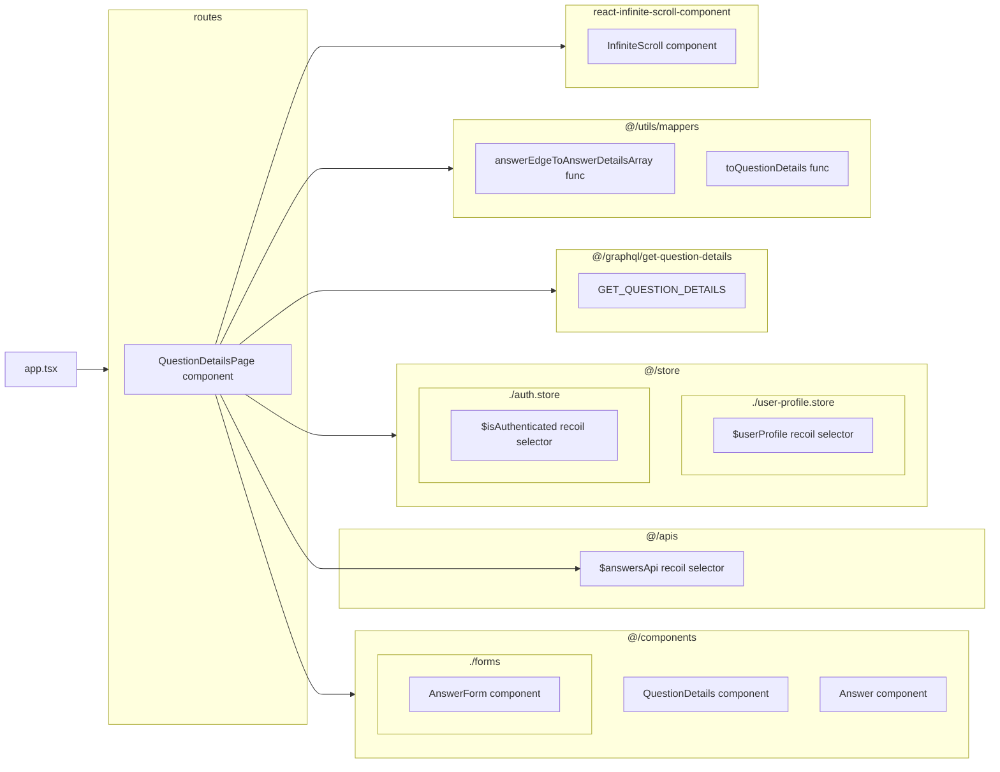

## `QuestionDetailsPage` component

This is the component that renders the question details page. This page has many complex parts that are all managed by this super component.

> We have plans to break this component down in the future

![[Pasted image 20240823094548.png]]

### Loading Question Details Content

This component uses `GET_QUESTION_DETAILS` query to fetch question data. Then uses the `toQuestionDetails` & `answerEdgeToAnswerDetailsArray` mapper functions to fit the data in a format compatible with the props of `Answer` & `QuestionDetails` components. These mapper functions also handle things related to date and time.

### Pagination of Answers

A question might have many answers to it, so we are using `InfiniteScroll` component to load more answers as user scrolls down the page.

### Handling User Interactions

Some handler functions are defined inside the component's function body which handle `deleting` answers and `toggling` an answer's acceptance status through calls to `$answersApi` methods . These functions also handle cache syncing

> We have plans to move these handlers inside `Answer` component in the future & extract cache management functionality into `CacheManager` class inside `@/apollo/cache-manager.ts` file

There's a link to `EditQuestionPage`, allowing the user to edit the question.

### Posting New Answers

In order to allow the user to post a new answer, this component renders an `AnswerForm` component passing it a `qid`.

You can find the details in this page: [[Posting A New Answer]]

### Action Permission Management

Some features like `editing` or `deleting` the question can only be done by an adminstrator or the author of the question. if `$userProfile.id` & the id of author of the question don't match, the **edit** and **delete** buttons will disappear.

Also, you **can't post an answer** if you are not logged in. The user is only allowed to view the site in **read-only** mode when they are not authenticated. 