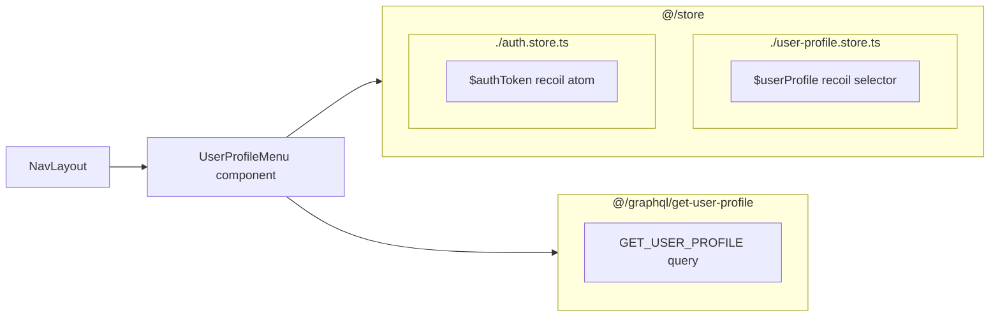

## `UserProfileMenu` component

This component renders user profile and provides links to these sections:
- my questions page
- edit profile page

###### logout functionality

and also it has a logout button which sets `$authToken` to `null` causing the app context to be unauthenticated and tokens to be removed from `local storage`.

###### loading user profile image

It gets user profile image through `GET_USER_PROFILE` query.

> We have plans to remove the need for this query in this component by adding a `profileImg` property on `$userProfile` recoil selector.

![[Pasted image 20240822155600.png]]

It decides to render only if `$userProfile` is not null (user has logged in), otherwise it will return `null` and as a result, the menu will disappear from the navbar. This happens only when user hasn't logged in.
